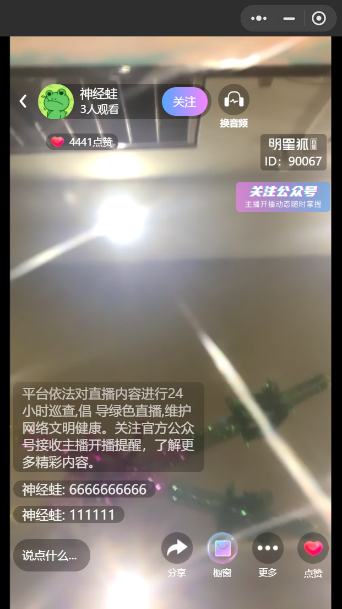

# 小程序直播开发

2021/03/24

## 系统要求：

操作系统：Android 7.0及以上

硬件：duhua大屏广告机

## 功能要求：

实现直播间正常播放，用户进入直播间可以进行正常观看，和主播互动，并能关注和取消关注主播。通过网络连接到直播媒体服务器，并实时播放服务器的FLV文件流，要做到低延迟，能够对服务器有一定的容错能力，比如断线重连，能够给用户提供完善的错误引导，支持定时重启。支付远程维护。

在网络正常的情况下，要求视频观看不能卡顿，在机器带宽或者cpu使用过高时能够选择合适的清晰度保证视频的正常播放。

### 1直播流的显示

app和服务器通信所使用的协议为rtmp协议，传输方式为tcp stream,视频封装格式为flv tag\(flv文件的tag\)。针对视频的显示，要求app能够做到可以根据网速选择不同的清晰度（高清，普通，流畅）来播放。

### 2用户评论的显示

app和服务器通信使用的协议为websocket,传输方式为TCP。要求app能够针对服务器发来的数据包进行解析并展示到界面。

### 3主播名称的显示

显示观看人数，点赞数，并能关注和取消关注主播。

### 4 展示主播的二维码

能够对服务器发来的二维码数据展示，保证用户可以正常扫码。

图1示例界面

